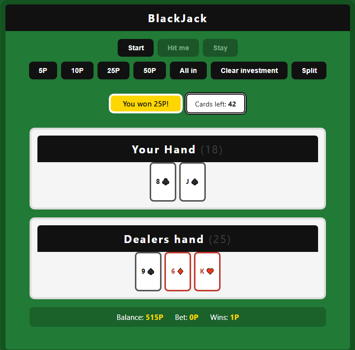

# BlackJack

# technologies used

1. HTML for the base game
2. CSS for the design layout and the design of the cards
3. JavaScript for the game logic and DOM manipulation

## Description

BlackJack is a casino card game which can be played with a deck of 52 cards each 13 card being represented in a different suite: ♠️Spades♠️, ♥️Hearts♥️, ♦️Diamonds♦️, ♣️Clubs♣️, in this game you will be playing against the dealer, which in this case will be the DOM in JavaScript, the goal is to get a hand value closer to 21 than the dealer or on 21 at the dot. there are many ways to loose i.e. your total hand value is 18 and you decide to stay and the dealers hand value end up being 20, since the dealer is closer to 21 than the player the computer wins, both the player and the computer can loose by busting which is reaching a hand value that is above 21, if the dealer and the player are on the same hand value then it is considered a push where you don't loose the amount of points you have used

## User stories

us a user, i want to ensure a clean and nice simple UI/UX and great functionality

## Screenshots

## Future Enhancements
1- more responsivity from javaScript
2- adding sounds for the deck
3- introduce a new mechanic called double down
## Usability testing

Jazzo: The game needs an all in button status(done), when the dealer has BlackJack it doesnt show both cards of the dealer that needs a fix. (done)

Fruit: The game worked fine i did not come into any issues.

PinkBerry: I dont understand the game personally it is not my own thing but i checked the console and i didnt see anything uninteresting maybe just remove the console.log checking (kept to ensure that codes are working)

## Credits (edited)
Mohammed Sarhan the creator

Special thanks to the usability testers as their input was put into great use

